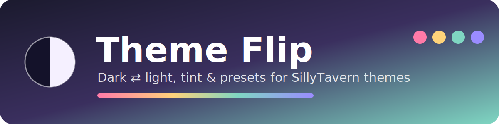

<p align="center"></p>

<p align="center">
  <b>English</b> · <a href="README.ru.md">Русский</a>
</p>

<p align="center">
  
  
  
  
</p>

# 🌓 Theme Flip

**Flip any SillyTavern theme between dark and light with one click — keeping its character — then paint the whole thing in any color you like.**

Pick a theme you love, press a button, and get a matching light version (or the other way round). Move one slider and the entire interface leans green, blue or peach — even themes that hard-code their colors in Custom CSS.

---

## ✨ Features

| | |
|---|---|
| 🌗 **Dark ⇄ light** | One click in the wand menu or the panel. Works in both directions and keeps the theme's hue, so a deep blue theme becomes a soft light blue. |
| 🎨 **Tint** | Six swatches or any custom color, plus a strength slider. Pulls *everything* toward that color, including colors that are "stuck" red or pink in the original theme. |
| 🎚️ **Fine tuning** | Saturation and background brightness sliders with live preview. |
| 👀 **Before / after preview** | A mini chat in the panel shows the original colors next to the result. The panel itself is painted in your *current* theme's colors. |
| 💾 **Presets** | Save a recipe (up to 30), apply it in a click. A preset is about 65 bytes — it stores the settings, not a copy of the theme. |
| 📤 **Export / import** | Share presets as a tiny `.json` file. A preset works on any theme. |
| ⏰ **Auto mode** | Follow the system light/dark setting, or switch by time of day. |
| 🌊 **Smooth transition** | Themes cross-fade instead of flashing. |
| 🌍 **English & Russian UI** | Follows SillyTavern's language setting. |
| 🔒 **Non-destructive** | Your theme file is never modified. Turn it off and everything is exactly as before. No network requests, everything lives in your browser. |

---

## 📦 Installation

**From GitHub (recommended)** — once this repository is published:

1. In SillyTavern open **Extensions → Install extension**.
2. Paste the repository URL and confirm.
3. Reload the page.

**Manually:**

1. Copy the `theme-flip` folder (it must contain `manifest.json`, `index.js`, `style.css`) to
   `SillyTavern/data/<your-user>/extensions/` (usually `default-user`).
2. Reload SillyTavern with a hard refresh (**Ctrl+F5**) — extension scripts are cached.

You will get:

- a **"Light / dark theme"** item in the wand menu (🪄) next to the message box,
- a **Theme Flip** panel in **Extensions** settings.

---

## 🚀 Quick start

1. Click **Light / dark theme** in the wand menu — the theme flips.
2. Open the **Theme Flip** panel. Pick a **tint** swatch to push the whole interface toward a color.
3. Adjust **saturation** and **background brightness** until it looks right.
4. Type a name and press **Save** to keep it as a preset.

---

## 🧭 The panel, control by control

| Control | What it does |
|---|---|
| **Light / Dark** | The look you want to see. Pressing the opposite of your theme's native look flips it. |
| **Before / after** | Live preview using your theme's actual colors. |
| **Tint** | Choose a swatch (or the rainbow circle for any color; the crossed circle turns tint off). The slider sets strength: from about 35% the hue fully follows the tint, higher values make colors more saturated. |
| **Saturation** | Makes all colors more muted or more vivid. |
| **Background brightness** | Nudges panels and message bubbles lighter or darker. |
| **Auto mode** | *Manual*, *System* (follows your OS light/dark setting) or *By time* (set when "light" starts and ends). Pressing the wand-menu button switches auto mode off. |
| **Presets** | Save the current look, click a chip to apply, ✕ to delete. **Export** downloads all presets; **Import** merges a file into yours. |
| **Switch dark ⇄ light** | Untick it to use only tint / saturation / brightness without changing the theme's light or dark nature. |
| **Reset** | Resets all sliders and tint. Your saved presets are kept. |

---

## 🧪 Presets and sharing

A preset is a tiny recipe. This is what an exported file looks like:

```json
{
  "themeFlip": 1,
  "presets": [
    { "n": "Mint light", "m": "l", "t": "#8fe0c4", "a": 80, "s": 100, "b": 0 }
  ]
}
```

| Key | Meaning |
|---|---|
| `n` | name (up to 30 characters) |
| `m` | `"l"` light, `"d"` dark |
| `t` | tint color (`""` = no tint) |
| `a` | tint strength, 0–100 |
| `s` | saturation, 30–160 (%) |
| `b` | background brightness, −10…6 |

The mode is stored as a *target look*, so "light, mint tint" gives a light mint theme whether you start from a dark or a light one. Imported files are validated: unknown keys are ignored and out-of-range numbers are clamped.

---

## ⚙️ How it works

Theme Flip never edits your theme. It adds a thin layer of styles on top and removes it when you turn it off:

1. **Theme variables** — SillyTavern's `--SmartTheme*` color variables are recalculated.
2. **Custom CSS** — the colors written in your theme's Custom CSS (hex, rgb, hsl, including custom variables and gradients) are read and recalculated by role: backgrounds, text, accents, borders, shadows.
3. **Chat content** — `<style>` blocks and inline colors inside messages are handled too, including new messages as they arrive.
4. **Page background** — if no real background image is set, the page behind translucent panels is recolored as well, so panels don't turn gray.

Colors are matched to roles by property and brightness, then mapped with HSL math so the hue is preserved. Images and `url(...)` graphics are never touched.

---

## ❓ FAQ / limitations

**Something is still the old color.** Colors baked into images, or set somewhere the extension can't read (for example another extension's own styles), stay as they are. With a **Tint** active, nearly every color in the theme and chat is pulled toward the tint, so try turning the tint up.

**A background image I set looks unchanged.** That's intended: real background images are left alone.

**The look is too pale / too strong.** Use the saturation and background sliders. Defaults live in the `TUNE` block at the top of `index.js`.

**Does it slow things down?** The theme is processed once when something changes. Chat content is handled incrementally: only *new* messages are looked at (at most every 250 ms), already-checked elements are never re-read, and while you drag a slider the chat is updated only after you stop. If you still notice lag in a very long chat, untick **Recolor chat content** in the panel — the theme and Custom CSS keep working, only colors written directly inside messages are left alone.

**Where is my data stored?** In your browser's `localStorage` (`themeFlip_settings`, `themeFlip_presets`, `themeFlip_light`). Nothing is sent anywhere.

**How do I remove it completely?** Delete the extension folder, and optionally clear those three `localStorage` keys.

**Debug.** In the browser console: `themeFlip.refresh()` re-applies everything.

Developed and tested on SillyTavern 1.19.0. The smooth transition uses the View Transitions API where the browser supports it and a plain cross-fade otherwise.

---

## 🤝 Contributing

Bug reports with a screenshot and the theme name are the most helpful. If a color isn't converted, please include the CSS rule or the message HTML that sets it.

## 📄 License

Choose and add a license file (for example MIT) before publishing.
